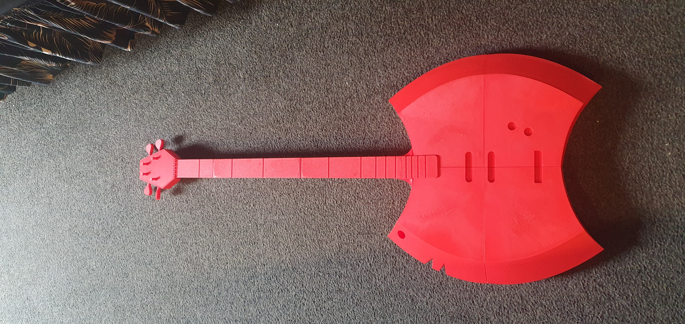

# Axe Bass — Adventure Time Prop

A full-scale replica of the Axe Bass from Adventure Time, modelled 
from reference and designed to be assembled in interlocking sections.

<table>
    <tr>
        <td align="center">
         Finished prop</td>
        <td align="center">
         Me with the prop</td>
    </tr>
</table>

## Overview

Over the 2025 inter-semester break, a family member requested I 
recreate Marceline's Axe Bass from Adventure Time. Having never 
done a project from conception through to fully constructed and 
painted, I took it on as a week-long challenge.

## How it works

### Proportions and detail
- Matched proportions to the show down to the smallest details
- Added small functional touches — turnable knobs and pegs, and a slot for a bass strap
- Slanted the headstock (the original is straight) and carved string channels through it for realism

### Assembly
- Body, neck, and tail spike split into sections to fit on a 245×245mm print bed
- Simple keying system between parts for easy orientation — pieces fit snugly without guesswork
- Frets made from black painted toothpicks, strings from white fishing wire
- Loctite 401 used to permanently lock parts on top of the tight key fit

## Build process

### References
- Used photos from the show to get the proportion of the separate parts I'll need to model

### Printing and Assembly

#### Tail Spike
<table>
    <tr>
        <td align="center">
         Tail spike on the bed</td>
        <td align="center">
         Tail spike assembled</td>
    </tr>
</table>

#### Neck and Head
<table>
    <tr>
        <td align="center">
         Neck on the bed</td>
        <td align="center">
         Neck assembled</td>
    </tr>
    <tr>
        <td align="center">
         Neck support</td>
        <td align="center">
         Head with all the pegs</td>
    </tr>
</table>

#### Body
<table>
    <tr>
        <td align="center" colspan="2">
         Almost assembled body showing the keying mechanism</td>
    </tr>
    <tr>
        <td align="center">
         Neck and body together</td>
        <td align="center">
         Strap lock</td>
    </tr>
    <tr>
        <td align="center">
         Strap lock with a strap</td>
        <td align="center">
         Lower body showing the ends of the fishing lines anchored and other small details</td>
    </tr>
    <tr>
        <td align="center">
         Black painted toothpicks on the channels of the painted neck as frets</td>
        <td align="center">
         Final assembled and cel shaded axe bass</td>
    </tr>
</table>

## Files
The stls are [here](stls).

## Printing
- 2x [knob](stls/knob.stl)
- 4x [nut](stls/nut.stl)
- 4x [peg](stls/peg.stl)
- 2x [stringGuideA](stls/stringGuideA.stl)
- 8x [stringGuideB](stls/stringGuideB.stl)
- Everything else just needs to be printed once
