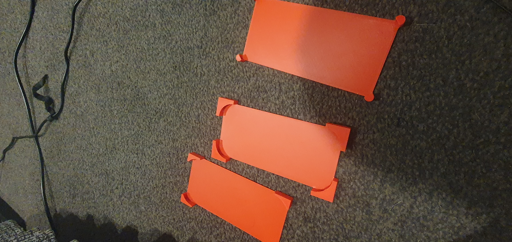
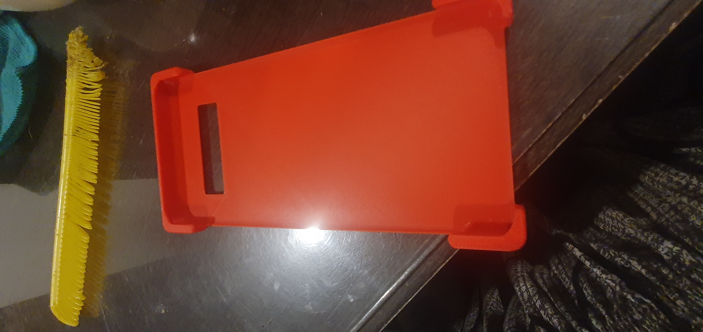
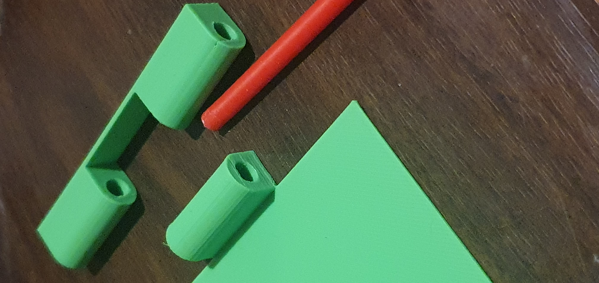
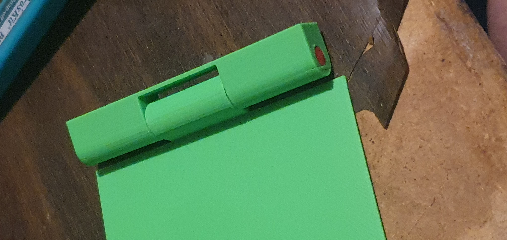
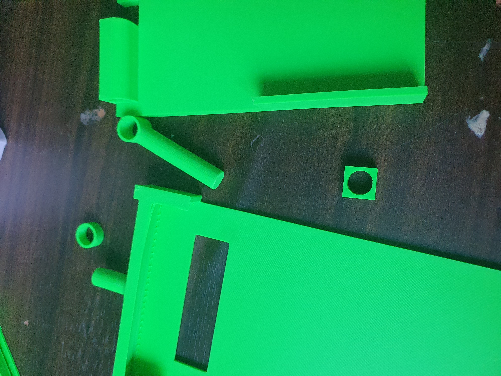

# Gimbal-Style Phone Case — S10+

A two-part gimbal-style phone case designed for the Samsung S10+, with a rotating assembly that allows free movement on one axis. Inspired by the [CaseCorder by Stephan Lemmer](https://www.etsy.com/shop/CaseCorder).

<table>
    <tr>
        <td align="center">
         Finished prop</td>
    </tr>
    <tr>
        <td align="center">
         Earlier revision - gimbal in action</td>
    </tr>
</table>

## Overview

Initially was just looking to design a phone case for my Samsung S10+ but it evolved into more as I got really interested in camcorders and stumbled across Stephan's Casecorder.

## How it works

- A simple case gimbal that allows the phone to rotate along 1-axis allowing for more ergonomic filming and photo taking at low or hard overhead positions
- Stephan built his CaseCorder based on a balljoint mechanism, which I figured would've been too weak on my heavier phone, so I opted for a long, solid tube as a pivot
- The case uses [screwmount](stls/screwmount.stl) as an option to tap a 1/4 in UNC 20 thread for mounting on tripods

### Assembly

Loctite 401 is used to permanently lock end caps close to parts, allowing for max friction but still allowing rotation.

## Build process

### Initial phone case

<table>
    <tr>
        <td align="center">
         Revisions 1-3</td>
        <td align="center">
         Revision 4 where I decided to implement the gimbal</td>
    </tr>
</table>

### Gimbal Implementation

First idea of a hinge mechanism to account for the heavy phone weight but it was too unreliable and overcomplicated.

<table>
    <tr>
        <td align="center">
         First hinge prototype</td>
        <td align="center">
         Completed hinge</td>
    </tr>
</table>

Went and redesigned the hinge into a gimbal as seen on the completed images at the top. An earlier revision is shown in the photo below, but the part count and assembly remain the same.
- Put the [hinge](stls/hingev5.stl) on the [case](stls/casev10.stl) and lock it with 1 [pincovers](stls/pincovers.stl)
- If you want a grip band on the [case cover](stls/coverv5.stl), then now is the easiest time to stitch it on (refer to the top image to see how it's meant to be stitched on)
- Slide the case cover channel over the hinge and use another pin cover to secure it tightly in place, making sure it's still able to rotate

<table>
    <tr>
        <td align="center">
         Entire disassembly</td>
    </tr>
</table>

## Files

The stls are [here](stls).

## Printing

- 2x [pincovers](stls/pincovers.stl)
- Everything else just needs to be printed once
