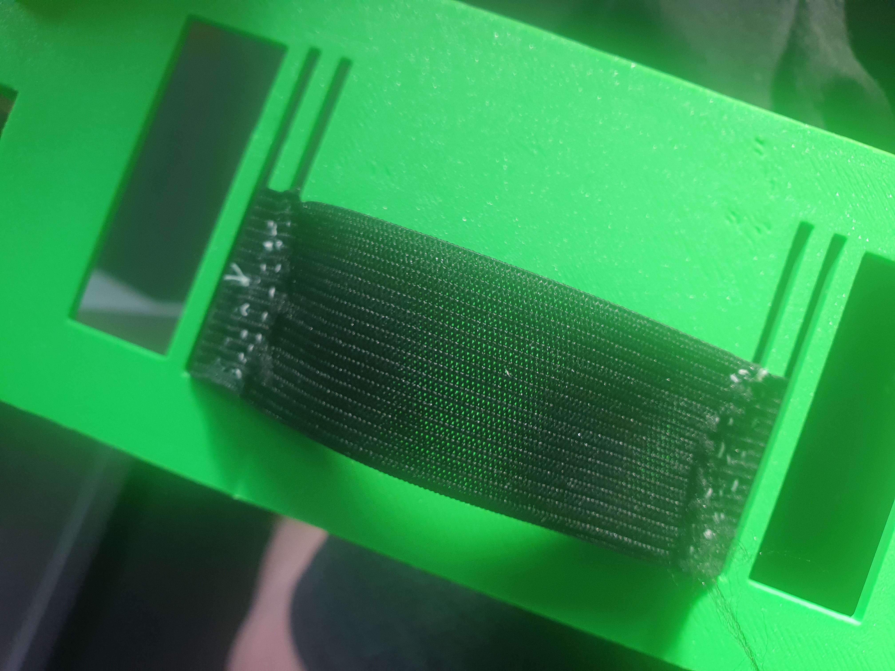

# Gimbal-Style Phone Case — S10+

A two-part gimbal-style phone case designed for the Samsung S10+, with a rotating assembly that allows free movement on one axis. Inspired by the [CaseCorder by Stephan Lemmer](https://www.etsy.com/shop/CaseCorder)

## Overview

Initially was just looking to design a phone case for my Samsung S10+ but it evolved into more as I got really interested in camcorders and stumbled across Stephan's Casecorder.

## How it works

- A simple case gimbal that allows the phone to rotate along 1-axis allowing for more ergonomic filming and photo taking at low or hard overhead positions
- Stephan built his CaseCorder based on a balljoint mechanism, which I figured would've been too weak on my heavier phone, so I opted for a long, solid tube as a pivot.
- The case uses [screwmount](stls/screwmount.stl) as an option to tap a 1/4 in UNC 20 thread for mounting on tripods

### Assembly

- Loctite 401 is used to permanently lock end caps close to parts, allowing for max friction but still allowing rotation

## Build process

Earlier revisions are shown in the photo, but still the same part count and assembly.
- Put the [hinge](stls/hingev5.stl) on the [case](casev10) and lock it with 1 [pincovers](puncovers.stl)
- If you want a grip band on the [case cover](stls/coverv5), then now is the easiest time to stitch it on (refer to the top image to see how it's meant to be stitched on)
- Slide the case cover channel over the hinge and use another pin cover to secure it tightly in place, making sure it's still able to rotate

[entire disassembly](20251121_100449.jpg)

## Files

The stls are [here](stls)

## Printing

- 2x [pincovers](stls/pincovers.stl)
- Everything else just needs to be printed once
