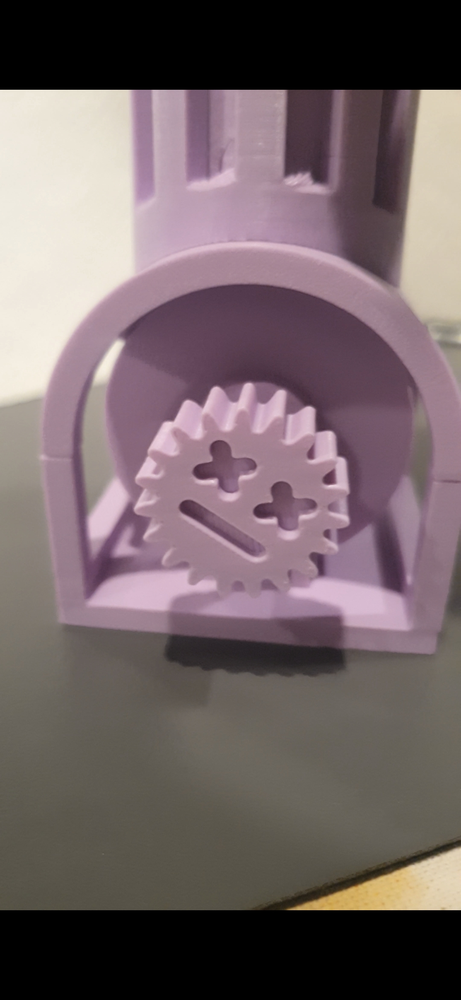
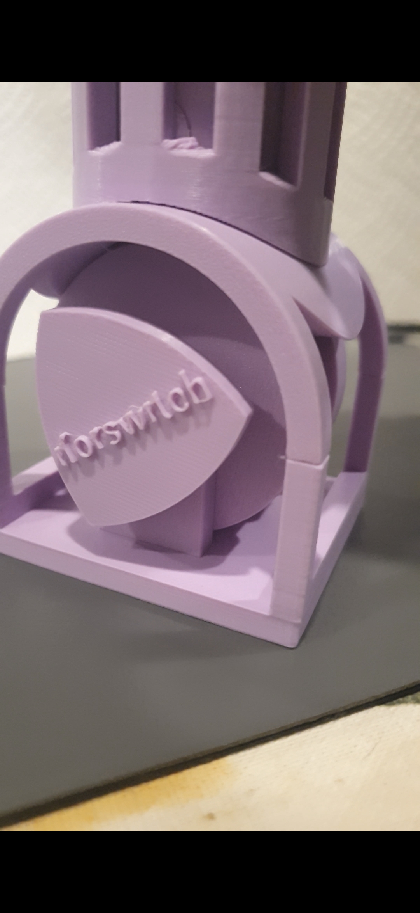
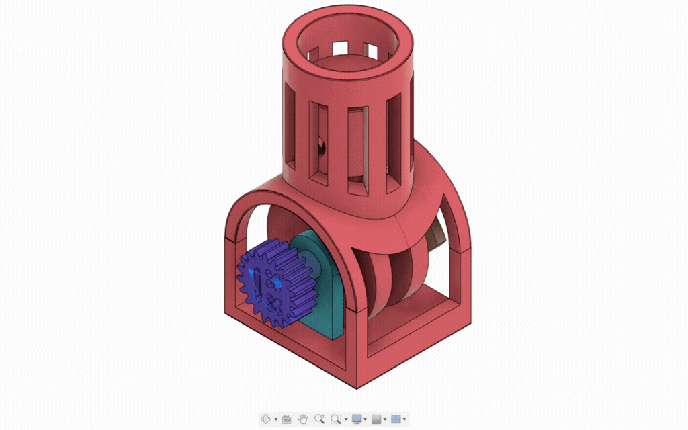

# Single Piston Engine

A fully functional single-piston engine desk toy, designed from the ground up for FDM printing — no supports, no overhangs, no wasted material.

<table>
    <tr>
        <td align="center">
         Front</td>
        <td align="center">
         Back</td>
    </tr>
    <tr>
        <td align="center">
         fusion360 motion study</td>
        <td align="center">
         Working mechanism</td>
    </tr>
</table>

## Overview

Wanted to try recreating a single-piston engine to better understand rotation-to-linear motion.

## How it works

A desk toy that you can spin and see the piston go up and down.

### Assembly

Just follow [assembly guide](singlepistonmanual.pdf).

## Files
The stls are [here](stls).

## Printing
- 2x [PistonPin](stls/PistonPin.stl)
- 2x [RodPin](stls/RodPin.stl)
- 4x [PistonPinLock](stls/PistonPinLock.stl)
- 2x [CrankPinFront](stls/CrankPinFront.stl)
- 2x [CrankPinRear](stls/CrankPinRear.stl)
- 2x [CrankPinHolder](stls/CrankPinHolder.stl)
- Everything else just needs to be printed once
